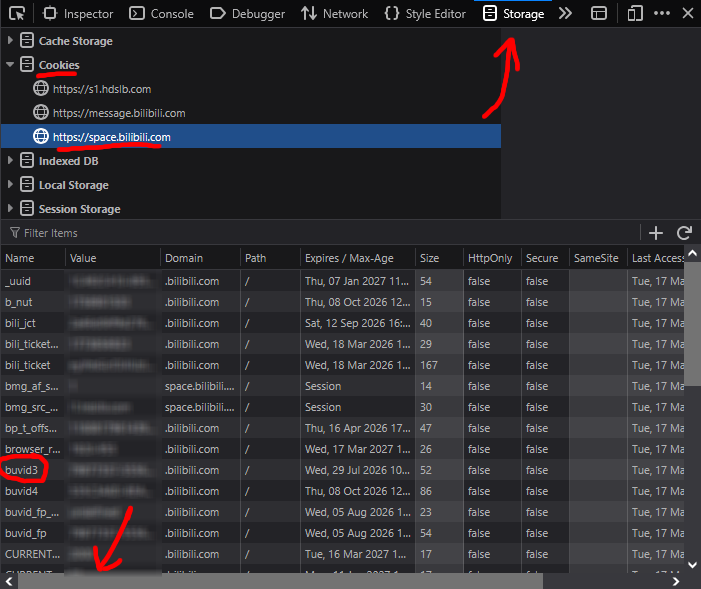

# \[6Maku\] BiliBili Live Message Triggers

A lightweight Node.js tool to capture BiliBili live room messages. When viewers spam specific keywords, it triggers on-screen images and sounds in real-time.

Made for streaming as a way for viewers to engage with and affect the stream. 

Inspired by DougDoug at [www.twitch.tv/dougdoug](https://www.twitch.tv/dougdoug)

## Download

```bash
git clone https://github.com/6Maku/BiliBili-Message-Triggers.git
```

Or you can download the zip on Github and extract it where you want the code to run.

## Setup

To use the code, you need to set it up to
* Look at your own channel (or someone elses)
* Get your cookie to login as yourself and access BiliBili
* Setup triggers, "Characters to match", "Image to show", "Sound to play".
I used "Xinema.png" + "InceptionHorn.mp3" and "HowHungry.jpg" + "Vineboom.mp3" for my images and sounds. As I do not have the rights to any of it, I will not distribute it. I trust that users of the software will be able to find these resources, or resources of their own by themselves.

All of these things are set in the `config.js` file.

To get your cookie, press F12 or right click inspect. Then in the window that apperas, look for a 'Storage' and then follow the image below.


The `SESSDATA` should also be in that list.

ATTENTION, the cookie may expire at some point. You will then need to update it. My cookies haven't expired for over a year, but consider this if you in the future have used the software for a long time and it then suddenly stops working.

## How to run

You need a software that can run node projects. For running with `node.js` you need to install `node.js`.

### Easiest option

If you have node installed, just run the `RunFirstTime.sh` or `Run.sh` file. 

### Run manually

Then, 
```bash
npm install
node server
```

You only need to run install once, and afterwards you can run with just `node server` or `node server.js`


## How to use

When the server is up, it will print whether it has connected to the live room on BiliBili, and you will also be able to see it catching messages in the console. 

To use it in OBS:
* add a `Browser source`
* Set link to `localhost:3000/ActivityTriggers`
* Set resolution to width: 1920, height 1080, or whatever you prefer. Mind that the size of this browser defines the resolution.
